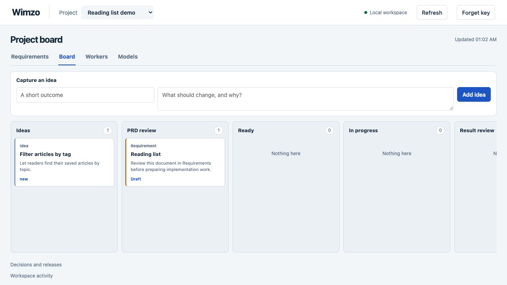

# Wimzo

A personal workspace for AI-assisted software development: requirements, approvals, coding-agent runs and verification in one durable workflow.

**Experimental, actively developed.** Built for a single trusted user on a local machine. This is a cleaned source snapshot of a working personal project, not a production service or a secure sandbox for untrusted agents.



## What it does

- Keeps canonical requirements in project files with revision history and review decisions.
- Exposes shared operations through a browser dashboard, CLI and MCP.
- Tracks ideas, approved work, worker runs, verification and result review.
- Integrates Codex SDK, Claude Agent SDK and Pi worker profiles.
- Uses isolated Git worktrees, bounded execution and persisted recovery records.
- Separates implementation completion from verification, owner acceptance and activation.

## Try the demo

Requires **Node.js 24+**, npm and Git. macOS is the primary development environment. Linux support is not yet verified; Windows is not supported.

```sh
git clone https://github.com/sebafudi/wimzo.git
cd wimzo
npm ci --ignore-scripts
npm run check
npm test
npm run demo
```

Open the private local URL printed by the demo. It contains synthetic project data, uses a temporary state directory, and does not dispatch workers or call inference APIs. Stop with Ctrl+C. Keep the URL private: its fragment contains a local access credential.

## Use with your own projects

```sh
npm run setup
npm start
# In another terminal:
npm run dashboard
```

Setup registers this checkout and captures draft specifications. It does not accept requirements or approve work. The service listens on `127.0.0.1:4317`. The dashboard command prints a private local link.

```sh
npm run cli -- tools
npm run cli -- status
npm run doctor
npm run stop
```

Starting the normal service schedules previously approved work in its state directory.

Default state is stored under `.wimzo/`. Set `WIMZO_STATE_DIR` to use a separate directory. Do not commit state, tokens, execution logs, environment files or project snapshots.

For MCP, configure a local stdio client with `node /absolute/path/to/wimzo/src/cli.ts mcp --role guide`. The guide role is preferable to owner access for ordinary assistant use. Review the exposed operations before connecting a client.

## Architecture

TypeScript on Node.js, SQLite persistence, a native HTTP server and a browser interface using HTML/CSS/JavaScript. The frontend does not use React.

```text
Browser / CLI / MCP
        |
Shared application actions and role checks
        |
Requirements, review, board and workflow
        |
SQLite state + canonical project files
        |
Worker profiles -> SDK adapters -> Git worktrees
```

`src/app.ts` is the shared action boundary. `domain.ts`, `documents.ts` and `review.ts` manage project intent and review. `workflow.ts`, `execution.ts` and the worker modules manage runs. `server.ts` and `dashboard.html` provide the local browser interface.

## Limitations and trust model

- Local roles and approval records help coordinate trusted tools. They are not an OS security boundary against software running as your user.
- Git worktrees isolate code changes, not filesystem access, secrets or networking. Worker permissions depend on the selected runtime and configuration.
- Do not expose the HTTP server through a public tunnel or use it as a multi-user service.
- Native desktop dispatch and hardware validation are not claimed by this project.
- Model catalogs, provider access and subscription eligibility can change. Verify your installed runtime and account before enabling real execution.
- Optional worker recommendations require explicit `WIMZO_ENABLE_EXTERNAL_RECOMMENDATIONS=1` opt-in and a TypeSafe API key; they transmit task content as described in [SECURITY.md](SECURITY.md). The demo needs no key. Real workers may use account quotas or incur costs under your provider's terms.
- Specifications describe intended behavior. Their existence does not prove implementation or test coverage.

## Development and publication

```sh
npm run check
npm test
node scripts/source-audit.mjs
```

Tests use temporary fixtures and fake runtime adapters. No provider credentials are needed for the test suite. See [publication notes](docs/PUBLICATION.md) for the exported scope and verification evidence.

AI tools were used extensively during development. The project explores explicit requirements, constrained execution, human review and independent verification rather than treating generated code as automatically correct.

## License

No open-source license has been granted yet. Source is published for inspection and discussion; third-party dependencies retain their own licenses.
